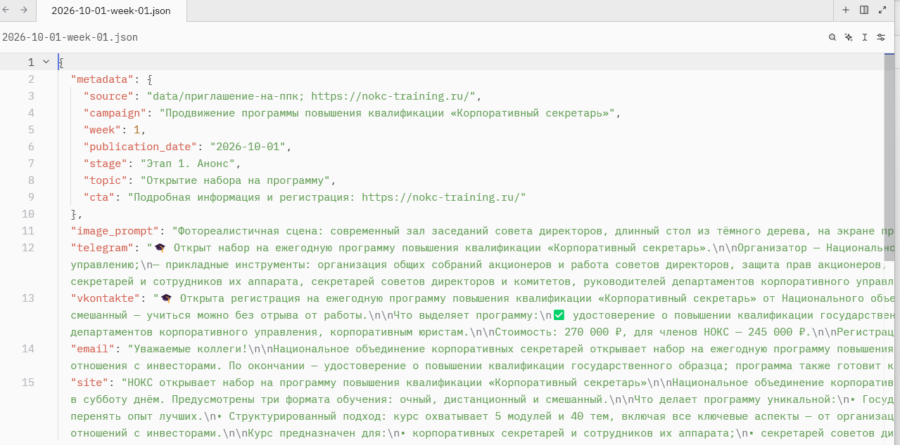

# Автоматизатор продвижения образовательных программ в заданных каналах (Marlene)

Промо-версия проекта ассоциации НОКС: подготовка и контроль продвижения образовательных программ (Telegram, ВКонтакте, e-mail, сайт) по плану-графику — от кампании в целом до готовых черновиков постов и иллюстраций.

**Текущая кампания:** программа повышения квалификации «Корпоративный секретарь» — 01.10.2026 — 28.01.2027, старт программы 30.01.2027. Аудитория: корпоративные секретари, офис-менеджеры, специалисты по корпоративному управлению.

Папка самодостаточна: здесь лежат план-график, тексты публикаций, материалы и правила работы агента. Открыв её как рабочую директорию Claude, можно продолжать кампанию без всякой настройки.



## Что уже сделано

- **План-график кампании** на весь период (01.10.2026 — 28.01.2027): этапы воронки, 17 публикаций, контрольные точки.
- **Тексты первого месяца** (октябрь, недели 1–5): по одному файлу на неделю, внутри — готовые тексты для каждой площадки (Telegram, ВКонтакте, e-mail, сайт), промпт и параметры иллюстрации, метаданные (этап воронки, тема, CTA).
- **Иллюстрация недели 1** с наложенным знаком качества НОКС.
- **Скрипт** наложения знака качества на любую картинку.

## Структура папок

```
├── CLAUDE.md    ← правила работы агента (обязателен в корне)
├── .claude/
│   ├── skills/  ← скиллы: smm-e-mail-marketing (превращает одно сообщение
│   │              о мероприятии в посты для сайта, Telegram, e-mail, ВК)
│   └── agents/  ← кастомные агенты проекта
├── data/        ← исходные материалы (приглашение-на-ппк, знак качества НОКС)
├── posts/       ← черновики публикаций: JSON по неделям + иллюстрации PNG
├── reports/     ← план-график кампании и отчёты
├── scripts/     ← PowerShell-скрипты (add-logo.ps1)
└── tmp/         ← временные артефакты работы агента
```

## Рабочие файлы

| Файл | Содержимое |
|---|---|
| `reports/2026-09-28-promo-kurs-korpos-plan-grafik.md` | План-график кампании: этапы воронки, 17 публикаций по неделям, контрольные точки (10.12.2026 — промежуточный итог, 28.01.2027 — итог кампании) |
| `posts/ГГГГ-ММ-ДД-week-NN.json` | Черновик недели: тексты для `telegram`, `vkontakte`, `email`, `site`; промпт для генерации иллюстрации; метаданные (этап, тема, CTA) |
| `posts/ГГГГ-ММ-ДД-week-NN-telegram.png` | Иллюстрация к посту недели (готовые — для недели 1) |
| `data/приглашение-на-ппк` | Текст приглашения на программу |
| `data/знак качества НОКС.jpg` | Знак качества ассоциации, накладывается на иллюстрации |

## Как запустить

1. Открыть эту папку как рабочую директорию Claude (план: `claude` из этой папки).
2. Скиллы подхватятся автоматически из `.claude\`.
3. Работать по правилам `CLAUDE.md`.

## Скрипты

`scripts\add-logo.ps1` — накладывает знак качества НОКС (прозрачный фон, правый верхний угол) на картинку:

```
powershell -ExecutionPolicy Bypass -File scripts\add-logo.ps1 -Base tmp\<файл> -Out posts\<результат>.png
```

Пример процесса изготовления иллюстрации — в скилле `smm-e-mail-marketing`.

## Правила работы

- Все материалы — **черновики**; публикация и рассылка — только после явного разрешения руководителя.
- Тексты генерируются помесячно: октябрь → ноябрь → декабрь → январь.
- Итог работы: короткое саммери + список изменённых/созданных файлов.
- Без явного разрешения не удалять и не переименовывать файлы, не отправлять что-либо наружу.

## MVP и развитие

**MVP (реализовано):** план-график на весь период кампании + комплект текстов для каждой площадки на первый месяц.

**Ближайшие шаги:**
- черновики постов за ноябрь (недели 6–11);
- иллюстрации к неделям 2–5 + знак качества;
- шаблоны e-mail-рассылки.

**Дальше:**
- контроль исполнения по графику (статусы «сделано / просрочено / под риском»);
- сводка статистики по контрольным точкам (10.12.2026 — промежуточный итог, 28.01.2027 — итог кампании).

---

*Ассоциация НОКС — специалисты в области корпоративного управления. В англоязычных материалах — NCSA (National Association of Corporate Secretaries).*